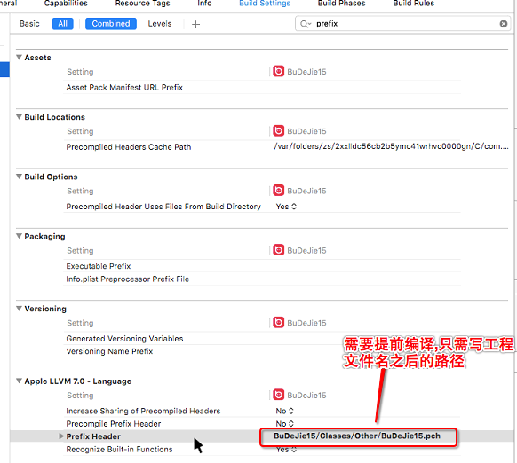
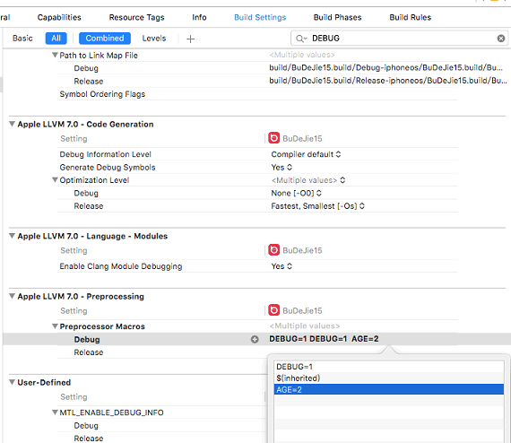

1. 
# iOS开发笔记-项目1--2

####知识点回顾

1.TabBar栏相关问题

>1.问题1:TabBar栏图片文字被渲染(只有tabBar上的按钮才会被渲染)

>解决方式:(图片渲染问题)
>
>1).手动修改图片的Render as的值为Original

>2).手动修改代码:调用imageWithRenderingMode方法  

>P.S 可以将获取没有被渲染的图片的方式抽取一个分类 
>(原因是为了能够复用)

>>注:分类只能扩充系统的方法,不能添加属性(注意一个设计思想:设计一个分类时,先不着急实现,先保证好用再去实现)

>解决方式(文字被渲染,修改文字大小)

>P.S 由于tabBar底部的相关信息是通过TabBarItem(模型)决定,而模型一般都是通过富文本设置属性的方式去设置问的颜色.字体等东西,因为不能直接拿到控件修改

```objc
    NSMutableDictionary * dict = [NSMutableDictionary dictionary];
    [dict setObject:[UIColor blackColor] forKey:NSForegroundColorAttributeName];//设置文字颜色
    [dict setObject:[UIFont systemFontOfSize:14] forKey:NSFontAttributeName];//设置文字大小
    [item setTitleTextAttributes:dict forState:UIControlStateSelected];
    [item setTitleTextAttributes:dictTab forState:UIControlStateNormal];

```

>P.S设置tabBar上按钮的文字字体大小,必须通过正常状态下,才能设置成功

>2.通过设置tabBarItem.imageInsets 值可以设置tabBar内部的图片的位置

>3.设置百思项目要求的按钮样式:系统的tabBar上按钮只有选中状态,但是实例程序是高亮状态
>>解决方式:中间按钮不能使用tabBar上的按钮,只能用UIButton ,同时要令系统tabBar上的按钮的enable属性为NO(失效),令UIbutton覆盖系统的按钮

>4.一定要先设置size,再设置center,sizeToFit方法会让控件从左上角向右下角延伸(在导航栏或tabBar中添加按钮时常用该方法)

>5.系统tabBar在viewWillAppear方法的[super viewWillAppear]方法里添加的tabBar按钮

2.获取全局UITabBarItem的外观

```objc

UITabBarItem * item = [UITabBarItem appearance];

```

> P.S 由于获取全局外观,并修改外观中属性(包括文字颜色.大小等信息)只需要设置一次,故只需要在+load方法中实现即可(**load方法:类一加载进内存就会调用,而且只调用一次**)--->相关联的还有一个initialize方法(**initialize方法:类一初始化就会调用**)

>1.appearance的相关问题:

>1)Q:任何类都可以使用appearance吗?
>>A:只有遵守了UIAppearance协议

>2)Q:哪些属性可以通过appearance去设置?
>>A:只要定义了UI_APPEARANCE_SELECTOR宏就能使用

>3)通过appearance去设置属性,必须在控件显示前去设置

>4)当出现诸如含:UIAppearance.m的错误提示信息时,是因为使用appearance设置了不该设置的东西

3.PCH文件

>作用:1)存放公用宏.2)存放公用头文件.3)自定义Log

>1.PCH文件有个规范:PCH文件名与项目名称一致

>2.编译前需要提前编译
>


>3.判断是否是OC文件

```objc
#ifdef __OBJC__
#endif
```

>4.自定义Log

```objc
#ifdef DEBUG // 调试
#define XMGLog(...) NSLog(__VA_ARGS__)

#else // 发布
#define XMGLog(...)
#endif
```

>5.也可以在这个位置定义宏
>

4.其他相关问题

>1)当自己设置frame的x.y值觉得麻烦时,可以设置一个UIView的分类

>P.S需注意:分类使用property时,由于只能生成set和get方法,不会生成带下划线的成员属性,故可以不用谢属性类型,但在变量名称之前建议使用前缀来表示,以防止与别人重复定义

>2)查找插件位置,并修改插件内信息的方式

>3)关于宏的第二种用法:宏可以用来作为注释使用