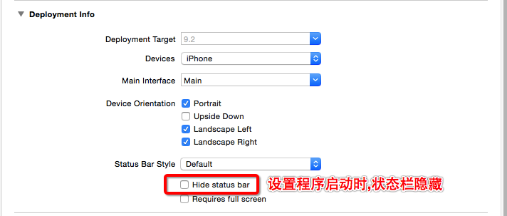

# iOS开发笔记-项目1

####一.新增知识点:

>1.关于开发中的颜色常识:

>>开发过程中,美工所强说的颜色为24位(即所谓的R.G.B各8位),而对于iOS开发而言,颜色信息为32位(多出一位即为透明度)

>>美工中的颜色取值为0~255,而iOS开发中的颜色取值为0~1(使用color的RGB方法时一定注意!!)

>>美工中的#代表十六进制数,与之形成对比:iOS开发中将OX代表十六进制

>>实际开发中若需要计算美工给予的十六进制数转换为开发中的什么颜色时,可以使用"UIColor+Hex"这个分类

####二.知识点回顾:

1.部分配置的用途:

>1)Bundle Identifier: APP中的唯一标识(作何使用?1.上传到appstore 2.推送)

>2)Deployment Target:部署版本(当前app支持系统的版本),即支持多少版本以上

>3)Status Bar Style:这个字段只用于程序启动时(图2)

>图1:

>图2:

>4)LaunchScreen和LaunchImage的区别:

>  LaunchScreen:自动识别当前模拟器或者真机的尺寸(本质是截屏)
  
>  LaunchImage:模拟器或者真机屏幕可视范围尺寸的启动图片决定

>  当设置了launch Screen File文件后,系统会默认执行这里的设置,当设置为空时,默认执行Launch Image Source内的启动项设置
  
>  P.S若存在删除LaunchScreen,但还是去加载LaunchScreen的情况,可以先清除缓存,或直接将模拟器或真机中的软件删除后再试
  
>5)动态库:需要用到时在加载  <========>  静态库:程序一运行就加载

>6)info.plist文件中修改bundle name可以修改程序的名称

2.UIWindow知识点回顾:

>[self.window makeKeyAndVisible]  窗口要显示的时候,就会把窗口的根控制器的view添加到窗口上

>makeKey:把当前窗口成为程序的主窗口(需要注意的是,若在还未执行这句话前,application.keyWindow是没有值得)

>Visible:让窗口可见(令visible.hidden = NO)

>**UIWindow的根控制器是苹果内部强制要求,必须是要有的**

3.UINavigationController 

>结构:1.包括自身的一个view(任何控制器都具有),2.专门存放⼦子控制器的View,3.导航条

>1.导航控制器的导航栏状态是由栈顶控制器决定的,导航控制器若没有根控制器,初始化时就没法设置导航栏状态,但后来若有添加控制器,则依然可以更改(导航条的内容由其当前所在的栈顶控制器的navigationItem来决定)

>2.显示在最外层的view是导航控制器栈顶控制器的view

>3.导航栏的Y值为20,高度为44,之所以显示时,上半部是一片灰蒙效果,是因为其导航栏的子控制器超出了其父控制器,(子控件超过父控件依然可以显示)

>4.initWithRootViewController方法底层会调⽤用push方法,把传⼊的子控制器,添加为导航控制器的子控制器.

>5.如果设置了导航控制器的标题,则push后子控制器的返回按钮上就是该导航控制器的标题

>6.通过修改leftBarButtonItem和rightBarButtonItem可以更改导航条上左右两部分显示的东西(**导航栏的左右侧类型是UIBarButtonItem,而titleView类型是UIView**)

>7.导航条(navigationBar)只能通过导航控制器获取

4.UITabBarController

>1.UITabBarController切换的原理:点击下面的按钮,会先把当前控制器的View从TabBarController存放⼦子控件View的View当中移除(只是移除view,子控制器还在数组当中,没有被移除),并把对应的子控制器的view添加上去

>2.UITabBar的高度为49

5.UIApplicationMain底层实现

>1.创建UIApplication对象(1.打开网页 2.设置联网状态 3.设置状态栏 4.设置提醒数字)

>2.创建UIApplication代理对象(1.监听应用程序声明周期 2.内存警告)

>3.开启主运行循环,保证程序一直执行

>4.判断info.plist有没有指定main,有就会去加载main.storyboard

>>**加载main.storyboard**

>>1.创建窗口

>>2.设置窗口根控制器

>>3.显示窗口
